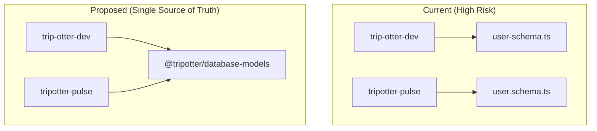

# Data Models & Schema Architecture

TripOtter utilizes **MongoDB** as its primary data store. Because the platform operates using a split-monolith architecture (Next.js for HTTP routes, NestJS for WebSocket processing), the database schemas are currently defined in two separate places.

:::danger CRITICAL TECH DEBT WARNING
The Mongoose schemas are duplicated across the `trip-otter-dev` and `tripotter-pulse` repositories. **They are currently out of sync.** Any changes to a database model must be manually applied to both repositories until a shared library is implemented. Failure to do so will result in data corruption or application crashes.
:::

---

## 🔍 The "User" Schema Drift Analysis

A direct comparison of the `User` schema reveals critical discrepancies between the frontend and the real-time backend.

### 1. The `emails` Relation (Missing in Frontend)

The NestJS (`Pulse`) schema includes a relation to an `Emails` collection that does not exist in the Next.js (`Dev`) schema.

```typescript title="tripotter-pulse/src/database/schemas/user.schema.ts"
// Exists in Pulse, Missing in Dev
emails: [
  {
    type: Schema.Types.ObjectId,
    ref: 'Emails',
  },
],

```

:::warning Risk
If the frontend attempts to overwrite a user document, it may strip this array, breaking email functionality in the backend.
:::

### 2. Password Hashing Logic

The Next.js (`Dev`) schema handles password hashing directly using a Mongoose `pre('save')` hook.

```typescript title="trip-otter-dev/utils/schema/user-schema.ts"
userSchema.pre("save", async function (next) {
  if (!this.isModified("password")) return next();
  const salt = await bcrypt.genSalt(10);
  this.password = await bcrypt.hash(this.password, salt);
  next();
});
```

:::warning Risk
The NestJS schema lacks this hook. If the `Pulse` service ever creates or updates a user password, it will be saved in plaintext.
:::

### 3. Collection Naming & Exports

The NestJS schema explicitly forces the collection name, while the Next.js schema infers it.

- **Pulse:** `collection: 'users'` explicitly defined in schema options.
- **Dev:** `model<UserDocument>('User', userSchema)` (Relies on Mongoose auto-pluralizing `User` to `users`).

---

## 🐛 Known Validation Bugs

Both schemas share identical validation logic, which currently contains a logical contradiction in the `username` field.

```typescript
username: {
  // ...
  minlength: [5, 'Username must be at least 3 characters'],
  match: [/^[a-z0-9_.]{6,20}$/, 'Username... must be 1–16 characters.'],
}

```

:::warning Action Required
This validation needs to be standardized. Currently, a user is told they need **3** characters via the error message, the `minlength` enforces **5**, and the Regex (`{6,20}`) strictly enforces **6**.
:::

---

## 📄 Other Critical Schema Discrepancies

### 1. The `Post` Schema Validation Missing

The Next.js (`Dev`) schema has a critical `pre('validate')` hook that ensures a post has either a caption or an image.

```typescript title="trip-otter-dev/utils/schema/posts-schema.ts"
// Exists in Dev, Missing in Pulse
postSchema.pre("validate", function (next) {
  const post = this as PostDocument;
  const hasCaption =
    typeof post.caption === "string" && post.caption.trim().length > 0;
  const hasImage = Array.isArray(post.image) && post.image.length > 0;

  if (!hasCaption && !hasImage) {
    next(new Error("At least one of caption or image is required"));
  } else {
    next();
  }
});
```

:::warning Risk
If the real-time engine creates or modifies a post, it completely bypasses this validation logic, potentially creating empty posts in the database.
:::

### 2. Mismatched Collection References

Across `Posts`, `Comments`, and `Tribes` schemas, there is a fundamental mismatch in how collections are referenced between the repositories.

- **Dev Environment References:** Uses singular, capitalized inferred names (e.g., `ref: 'User'`, `ref: 'Comment'`, `ref: 'Post'`).
- **Pulse Environment References:** Uses pluralized explicit collection names (e.g., `ref: 'users'`, `ref: 'comments'`, `ref: 'posts'`).

:::warning Risk
`mongoose.populate()` may fail silently or throw errors if the reference model names do not strictly match the registered model names in each respective schema context.
:::

### 3. Validation Error Message Drifts

Some validation messages differ entirely in their wording, which can cause inconsistent error states to be displayed to users depending on which microservice rejected the request.

- `tribes-schema.ts` (Dev): `name: { required: [true, 'Tribe name is required'] }`
- `tribe.schema.ts` (Pulse): `name: { required: [true, 'Group name is required'] }`

---

## 📚 Core Entity Dictionary

### The `User` Entity

- **Primary Key:** `_id` (ObjectId)
- **Idempotent Key:** `serial` (UUIDv4) - Used for public-facing identification to prevent sequential ID guessing and tracking.
- **Roles:** Enforced via Enum.
- `USER`: Standard account.
- `BUSINESS`: Upgraded account for shop owners.

- **State Management:**
- `active`: Boolean flag used for soft-deletes or bans, rather than dropping the document from the database.

---

## 🏗 Future Recommendation: The "Shared Types" Package

To resolve the Schema Drift, TripOtter should migrate the database models to a Monorepo workspace (e.g., Turborepo) or publish a private NPM package (e.g., `@tripotter/database-models`).

This ensures a single source of truth for all Mongoose models and TypeScript definitions.


