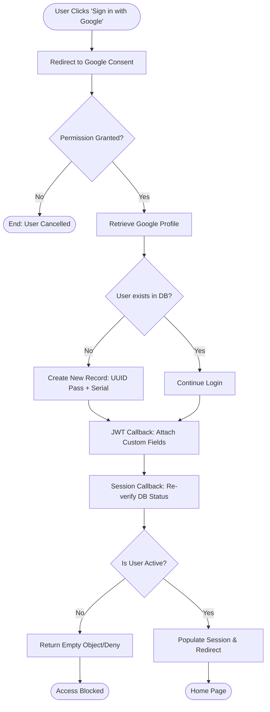
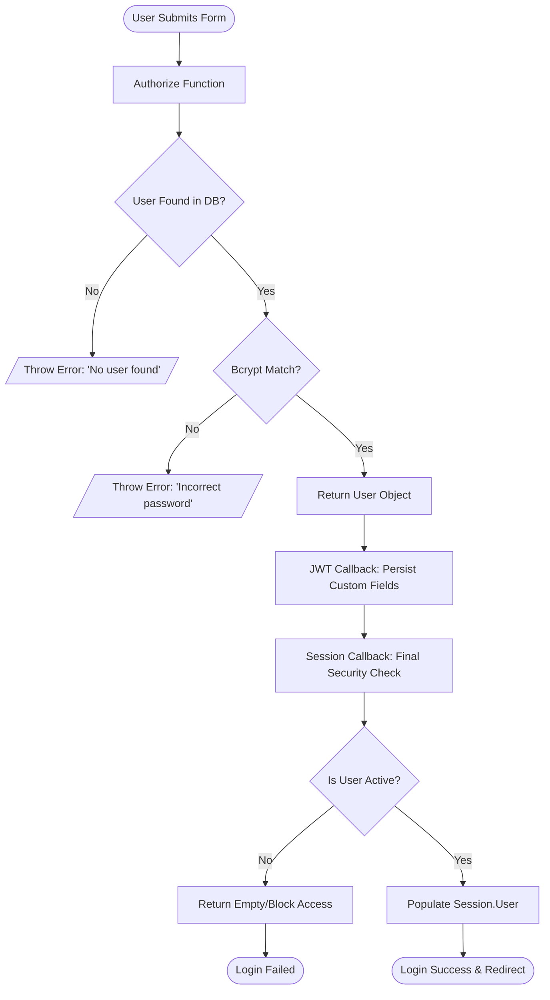

# Authentication Flow

The authentication flow for **Tripotter Web** is powered by `Next-Auth`. It supports both OAuth (Google) and traditional Credentials (Email/Password) providers, integrated with a custom MongoDB schema via Mongoose.

# Authentication Steps - Sign in with google



When a user clicks **"Sign in with Google"**, the following steps occur based on your `Next-Auth` implementation:

1. **Redirection**: Next-Auth redirects the user to Google's consent screen (configured in your `Google` provider with `prompt: "consent"`).
2. **Authorization**: The user logs in via Google and grants permission. Google sends an authorization code back to your callback URL.
3. **Profile Retrieval**: Next-Auth exchanges the code for the user's Google profile (email, name, image).
4. **`signIn` Callback**:

- The system checks your database via `userSchema.findOne({ email: profile.email })`.
- **If New User**: It creates a new record using `userData.save()` with a generated `username` and a `v4()` UUID password.
- **If Existing User**: It returns `true` to proceed.

5. **`jwt` Callback**: The user’s database specific info (`id`, `serial`, `username`, `fullName`) is attached to the JWT token.
6. **`session` Callback**:

- The database is queried one last time to ensure the user is still `active`.
- If active, it populates the `session.user` object with the data from your MongoDB.

7. **Final Redirect**: The user is redirected back to the application with an active session cookie.

# Authentication Steps - Sign in with credentials



When a user clicks **"Sign In"** using the Credentials provider (Email/Password), the flow follows these specific steps based on your implementation:

1. **Form Submission**: The user submits their email and password from your custom `/login` page.
2. **`authorize` Function Trigger**: Next-Auth passes the credentials to the `authorize` block in your config.
3. **Database Lookup**: The code runs `userSchema.findOne({ email })` via `runDBOperation`. If no user is found, it throws a "No user found" error.
4. **Password Verification**: `bcrypt.compare` checks the submitted password against the hashed password in MongoDB. If they don't match, it throws an "Incorrect password" error.
5. **User Object Return**: If valid, it returns a user object containing the `id`, `serial`, `email`, `fullName`, and `username` fetched from the database.
6. **`jwt` Callback**: The object returned by `authorize` is passed to the `jwt` callback, where the custom fields (`serial`, `username`, etc.) are persisted into the token.
7. **`session` Callback**:

- It performs a final security check by re-fetching the user from the database.
- It validates if the user is `active`. If the account is disabled or missing, it returns an empty user object to block access.
- If active, it populates the final session object used by the frontend.

8. **Session Completion**: The user is authenticated and redirected to the home page (or the `callbackUrl`).

## Configuration Overview

The core logic resides in `@/auth/index.ts` and is exposed via the Next.js App Router in `@/app/api/auth/[...nextauth]/route.ts`.

### Supported Providers

- **Google OAuth**: Automatic user registration on first sign-in.
- **Credentials**: Email and password validation using `bcrypt` and MongoDB.

## Type Extensions

To ensure type safety across the application, `next-auth` modules are extended to include custom user fields:

```typescript
declare module "next-auth" {
  interface Session {
    user: {
      id: string;
      serial: string;
      username: string;
      name: string;
      email: string;
      image: string | null;
    };
  }

  interface User {
    id: string;
    serial: string;
    username: string;
    fullName: string;
    email: string;
    image?: string | null;
  }
}

declare module "next-auth/jwt" {
  interface JWT {
    id: string;
    serial?: string;
    username?: string;
  }
}
```

## Auth Lifecycle Callbacks

The implementation utilizes three key callbacks to manage user state:

### 1. `signIn`

Handles the logic for Google OAuth users. If a user logs in via Google and doesn't exist in our database, a new record is created automatically with:

- A sanitized `username` derived from their email.
- A unique UUID as a placeholder password.
- Automated agreement to terms.

### 2. `jwt`

Persists database-specific identifiers (`id`, `serial`, `username`) into the JSON Web Token.

### 3. `session`

The session callback performs a security check on every request:

- It verifies if the user still exists in the database.
- It checks the `active` status of the account.
- If the account is inactive or missing, the session is invalidated (`undefined`).

## Implementation Details

### Database Operations

All database calls are wrapped in `runDBOperation` to ensure stable connections and consistent error handling.

### Custom Pages

The flow is configured to use custom UI components instead of default Next-Auth views:

- **Sign In**: `/login`
- **Error**: `/login`

## Usage in App Router

To access the session in Server Components or API routes, use the exported `auth` function:

```typescript
"use client";

import { signIn, useSession } from "next-auth/react";
import { useRouter } from "next/navigation";
import { useEffect } from "react";

export default function ClientPage() {
  const { data: session, status } = useSession();
  const router = useRouter();

  useEffect(() => {
    if (session) {
      router.push("/feed");
    }
  }, [session, router]);

  const handleLogin = async (data) => {
    const res = await signIn("credentials", {
      redirect: false,
      email: data.email,
      password: data.password,
    });

    if (res?.ok) {
      router.push("/feed");
    }
  };

  if (status === "loading") return <div>Loading...</div>;

  return (
    <div>
      {!session ? (
        <button onClick={() => signIn("google", { callbackUrl: "/feed" })}>
          Login with Google
        </button>
      ) : (
        <h1>Welcome, {session.user.username}</h1>
      )}
    </div>
  );
}

```
